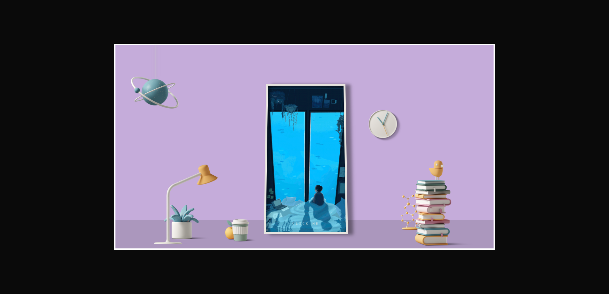

<div align="center">
  
</div>

## Desk Setup 3D

[](https://github.com/joaorceschini)
[](#)
[](https://github.com/joaorceschini/podcastr/stargazers)

<h4 align="center">
  Quarto 3D interativo.
</h4>




## Começando

**Faça o clone do projeto**

```bash
$ git clone https://github.com/joaorceschini/desk-setup-3d.git
```

Depois acesse o arquivo `index.html` em seu navegador.

## Tecnologias

<div align="center">
  <br />
  
</div>

---

Inspirado no projeto [「ｒｅｆｌｅｃｔｉｏｎｓ」](https://codepen.io/jackiezen/pen/JjJxGOY) ❤️